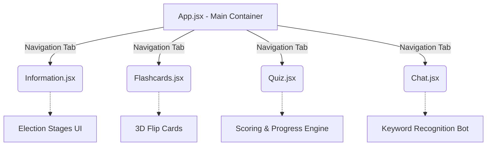
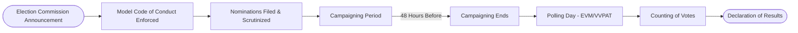

# 🇮🇳 India Election Guide

An interactive, educational web application designed to help citizens understand the Indian Election process, key terminologies, and test their knowledge. Built with a premium, glassmorphism-inspired UI and vibrant colors.

## 🌟 Key Features

- **📖 Interactive Information Guide**: Learn about the essential stages of the Indian democratic process, from the announcement of dates to the counting of votes.
- **🃏 Flashcards**: A 3D flip-card system to memorize critical election acronyms and terms like EVM, VVPAT, NOTA, and the Model Code of Conduct (MCC).
- **📝 Knowledge Quiz**: A dynamic multiple-choice quiz with immediate feedback, score tracking, and a progress bar to test your understanding.
- **🤖 Election Assistant Chatbot**: An integrated, keyword-based conversational AI bot that answers frequently asked questions regarding the voting age, election processes, and the Election Commission.

## 🛠️ Technology Stack

- **Framework**: [React](https://reactjs.org/) + [Vite](https://vitejs.dev/)
- **Styling**: Vanilla CSS with custom properties (CSS variables) for dynamic themes and Glassmorphism design techniques.
- **Icons**: [Lucide React](https://lucide.dev/)
- **Deployment**: Google Cloud Run (Docker + Nginx)

---

## 🏗️ Application Architecture

The application is structured into modular React components, allowing seamless navigation between different educational tools.



## 🗳️ The Indian Election Process Flow

Understanding the flow of the Indian Election System:



---

## 🚀 Getting Started

To run this project locally, follow these steps:

### Prerequisites
- Node.js (v18 or higher)
- npm or yarn

### Installation

1. **Clone the repository:**
   ```bash
   git clone https://github.com/dipalishaw22/India-Election-Guide.git
   cd India-Election-Guide
   ```

2. **Install dependencies:**
   ```bash
   npm install
   ```

3. **Start the development server:**
   ```bash
   npm run dev
   ```

4. Open your browser and navigate to `http://localhost:5173/`.

## ☁️ Deployment to Google Cloud Run

This project includes a `Dockerfile` and `nginx.conf` making it ready for containerized deployment on Google Cloud Run.

1. Ensure you have the `gcloud` CLI installed and authenticated.
2. Build and deploy:
   ```bash
   gcloud run deploy indian-election-app --source . --allow-unauthenticated --region us-central1
   ```
